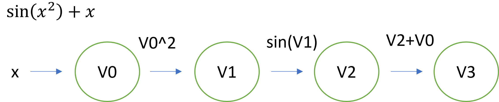
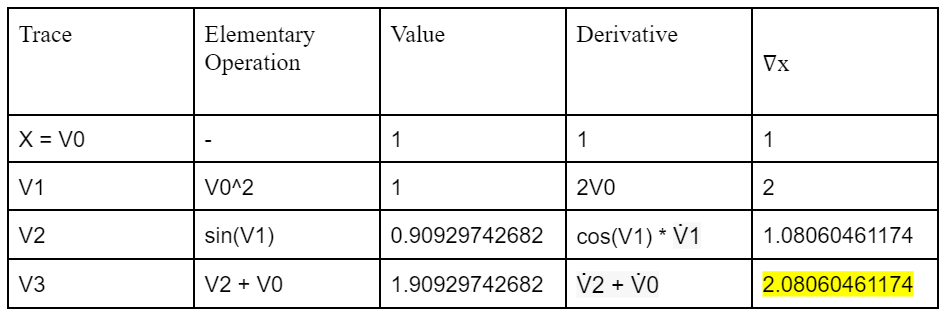

# Documentation 

## Introduction
Differentiation is one of the most important operations in mathematics and computation. A derivative measures the sensitivity of change of the output of a function with respect to changes in its input. Derivatives can be calculated symbolically using calculus rules such as the chain rule, product rule, and quotient rule. Symbolically evaluating the derivative ensures accuracy, but these calculations can be costly and might not work for certain functions. We can use numerical methods like the Finite-Difference method to overcome these problems. However, due to rounding errors and possible numerical instability, numerical methods also have their shortcomings. Automatic Differentiation (AD) is less costly than symbolic differentiation, and unlike numerical methods, evaluates derivatives to machine precision. Thus, AD is a good choice for most software that requires differentiation.


## Background
The basic idea of AD is that we can represent complicated functions as a sequence of elementary functions and arithmetic operations. Thus, we can solve complicated derivatives by evaluating their simple components in a step by step manner. AD relies on the chain rule, which gives us a way to calculate the derivative of a compound function. To organize the flow of AD we introduce a graph structure.
Consider the simple one variable function }+x). We can construct the following graph structure to represent the steps needed to evaluate this derivative.




Here, each intermediate result is a node in the graph. The nodes are linked together either by arithmetic operations or by elementary functions.
If we want to evaluate the derivative of the function, we can just work through each node in the graph. Suppose we wanted to evaluate the derivative of }+x) at 1, we can construct the following table to calculate the derivative step by step.



Note that the value highlighted in yellow is exactly }+1) for  (what we would get if we evaluated this derivative symbolically. This method of automatic differentiation is known as Forward Mode Automatic Differentiation and can be extended to higher dimensions.

## How to Use Our Package
### How to install 

#### Installation via GitHub
1. Clone the package repository into your working directory with `git clone https://github.com/cs107-colorful-axolotls/cs107-FinalProject.git`
2. Install the required dependencies for this package with `pip install -r requirements.txt`
3. Import modules into your code

Use documentation to get code explanations and code examples to quickly get started.

#### Installation via PyPi
TODO: add once package is on PyPi

### Demo
Instantiating AD Objects and checking that they work:
```python
from fnode import Fnode
import elem_fn as elem
import numpy as np

v_0 = Fnode(3.0, 1.0)
v_1 = elem.sin(3 * v_0 + 1)

assert v_1.val == np.sin(10.0)
assert v_1.deriv == 3 * np.cos(10.0)
```

## Organization 

### Directory Structure
```
cs107-FinalProject/
    docs/
    src/
      forward_mode/
        elem.py
        fnode.py
        vector_fn.py
      reverse_mode/
        elem.py
        rnode.py
    tests/
```
* The `docs/` subdirectory contains documentation about using the library.

* The `src/` contains further subdirectories containing source code for automatic differentiation.
  * `forward_mode/` contains source code for forward mode for automatic differentiation
  * `reverse_mode/` contains source code for forward mode for automatic differentiation
    

* The `tests/` subdirectory contains tests written to be compatible with `pytest`, so that they can be automatically run and code coverage reports can thus be generated.

### Basic Modules
#### External Dependencies:
    * `numpy` is be used to conduct many of the numerical calculations and array manipulation operations related to automated differentiation.
    * `pytest`is used in the test suite

#### Internal Modules:
  * The `forward_mode` module contains the objects and functions necessary to do forward mode automatic differentiation on real and vector valued functions 
  * The `reverse_mode` module contains the objects and functions necessary to do reverse mode automatic differentiation on real functions

## Implementation Details 
### Core Classes 
### Elementary functions


## Extension 

Our extension is reverse mode automatic differentiation. We implemented a new class of nodes called `Rnode` and compatible elementary functions to achieve this.

### Reverse Mode Background

Forward mode automatic differentiation can be computationally expensive when you need to calculate the gradient of complicated multi-variate functions.
Reverse mode automatic differentiation overcomes this issue. 

Consider same function used above: }+x). 
Recall it can be represented with the following computational graph 


First, a sweep is done in the forward direction of the computational graph to calculate the values of each node. (Right table below)
Then, a second sweep is done in the backward direction of the graph. (Left table below) Using the chain rule, and taking partial derivatives, the derivative value at each node can be deduced. 
The only subtly occurs when the derivative can be calculated coming through two nodes. For example, V0 is involved coming from the V3 and V1 node. In this case the two values of the derivative need to be added to together (See second row in the left table.)
Again, note that reverse mode correctly calculates the derivative. 


### Demo 

## Broader Impact and Inclusivity Statement


Automatic Differentiation is a powerful tool that automates the calculation of complex derivatives. Our package provides a fast, accurate way to calculate the gradients of functions of many variables.  Using our library correctly reduces the risk of human errors. However, it is important that the users of this software read the documentation before use. Misuse of our package could introduce errors into the users’ calculations, potentially invaliding their results. It is a well-documented phenomenon in human factors engineering that humans are less skeptical of results when they come from a machine automated algorithm. In risk adverse fields it is important that the users of this package validate their results to make sure they are using it correctly. 

Our automatic differentiation library is easily accessible to anyone who has access to PyPI. Hosting code on PyPI makes it easy to install with a single line, thus removing barriers to use. We aim to make the library even more user friendly by providing adequate documentation. This documentation explains how to use the package, and the relevant mathematical concepts in a clear, concise manner. Thus, you do not need to be a Python expert or a mathematician to use our library. Those wishing to contribute can request access and submit a pull request to our GitHub repo.


## Future