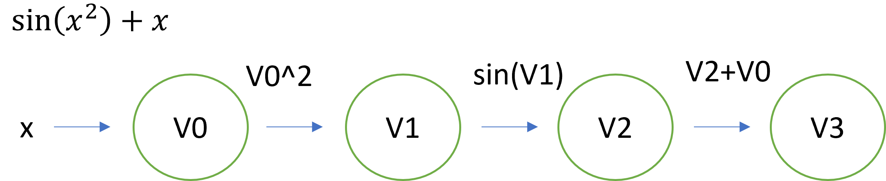
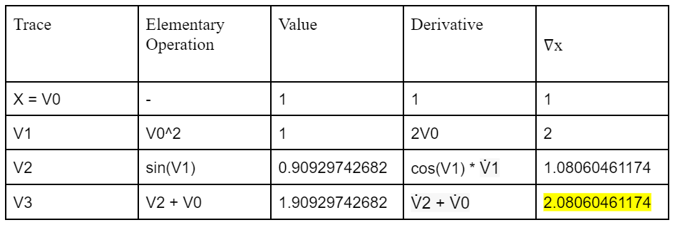

# Milestone 1

## Introduction
Differentiation is one of the most important operations in mathematics and computation. A derivative measures the sensitivity of change of the output of a function with respect to changes in its input. Derivatives can be calculated symbolically using calculus rules such as the chain rule, product rule, and quotient rule. Symbolically evaluating the derivative ensures accuracy, but these calculations can be costly and might not work for certain functions. We can use numerical methods like the Finite-Difference method to overcome these problems. However, due to rounding errors and possible numerical instability, numerical methods also have their shortcomings. Automatic Differentiation (AD) is less costly than symbolic differentiation, and unlike numerical methods, evaluates derivatives to machine precision. Thus, AD is a good choice for most software that requires differentiation.

## Background
The basic idea of AD is that we can represent complicated functions as a sequence of elementary functions and arithmetic operations. Thus, we can solve complicated derivatives by evaluating their simple components in a step by step manner. AD relies on the chain rule, which gives us a way to calculate the derivative of a compound function. To organize the flow of AD we introduce a graph structure.
Consider the simple one variable function }+x). We can construct the following graph structure to represent the steps needed to evaluate this derivative.



Here, each intermediate result is a node in the graph. The nodes are linked together either by arithmetic operations or by elementary functions.
If we want to evaluate the derivative of the function, we can just work through each node in the graph. Suppose we wanted to evaluate the derivative of }+x) at 1, we can construct the following table to calculate the derivative step by step.



Note that the value highlighted in yellow is exactly }+1) for  (what we would get if we evaluated this derivative symbolically. This method of automatic differentiation is known as Forward Mode Automatic Differentiation and can be extended to higher dimensions.
## How to Use `autodiffer`

1. Clone the package repository into your working directory with `git clone https://github.com/cs107-colorful-axolotls/cs107-FinalProject.git`
2. Install the required dependencies for this package with `pip install -r requirements.txt`
3. Import the package in your python code with `import autodiffer`

Use documentation to get code explanations and code examples to quickly get started.

Instantiating AD Objects:
```python
import autodiffer as ad
import numpy as np
ad_cos = ad(np.sin())
ad_cos.derivative()
value, derivative_eval  = ad_cos.evaluate(np.pi)
# value = 0, derivative_eval = -1
```

## Software Organization

#### Directory Structure
```
cs107-FinalProject/
    docs/
    src/
        forward_mode.py
        reverse_mode.py
        utilities.py
        __init__.py
    tests/
```
* The `docs/` subdirectory will contain documentation about using the library.

* The `src/` subdirectory will contain further subdirectories containing source code for automated differentiation.

    * The `forward_mode.py` file will contain source code that implements forward mode automated differentiation.
    * The `reverse_mode.py` file will contain source code that implements reverse mode automated differentiation. (While reverse mode is not part of the minimum requirements, we do see that implementing something extra is required, so we are planning ahead here.)
    * The `utilities.py` file will contain source code that implements any helper functions common to both forward and reverse mode automated differentiation as well as code that helps with visualization and debugging.
    * The `__init.py__` file will contain code to import external dependencies and set up automated differentiation.

* The `tests/` subdirectory will contain tests written to be compatible with `pytest`, so that they can be automatically run and code coverage reports can thus be generated.

#### Modules 

* External Dependencies:
    * `numpy` will be used to conduct many of the numerical calculations and array manipulation operations related to automated differentiation.
    * `scipy` has modules that do numerical differentiation. We will not use this module in our implementation, but it does provide a useful benchmark to verify the correctness of our implementation as well as be a performance benchmark for timing.

* Internal Modules: In each of the subdirectories of `src/` we plan on having an `__init__.py` module that imports necessary external dependencies and modules from elsewhere in the codebase. We will also include modules for elementary functions, such as `sin()`, `cos()`, `exp()`, and `log()` to name a few. We will also be overriding many of the dunder methods, such as `__add__()` and `__eq__()` to name a few. We will have these functions return not only the result of the operation on two functions, but also the result of the operation on their derivatives.

#### Testing, Continuous Integration, and Devops

* As described in the `Directory Struture` section above, the test suite will be contained in the `tests/` subdirectory of the project repository.

* We have already set up `TravisCI` to automatically check if builds and tests pass and `CodeCov` to generate code coverage reports. We will each "own" the code that we write, which means being responsible for writing tests for that code. As a best practice, we will attempt maintain greater than 90% code coverage at all times.

* As a general rule, each milestone will have its own branch on the GitHub repository. When code is being implemented, each person will work off of their own branch, or branches. To merge code into the `main` branch, the group member will open a pull request and solicit code reviews and approvals before merging.

#### Distribution

We are planning on two methods of distributing our code.

* GitHub: Users wishing to use our automated differentiation package can clone this repository and run a setup script to get set up.

* Python Package Index (PyPI): Users will also be able to use `pip install` to download and setup our automated differentiation package. We plan to follow the steps outlined [here](https://packaging.python.org/tutorials/packaging-projects/).

#### Packaging and Frameworks

* We plan to follow the steps outlined in the second bullet point of the `Distribution` section to package our code for PyPI.

* While not exactly a framework, we came across [PyScaffold](https://pyscaffold.org/), which helps with formatting and organizing our repository in a way that will make it easier to be packaged and distributed on PyPI.

#### Other Considerations

This is only a preliminary design. As with all software engineering projects, the design and organization of the software will change as the project evolves.

## Implementation

#### Core Data Structures

The core data structure of our software will be an implementation of dual numbers. Recall that a dual number consists of a real part and dual part,

Where  and  are reals and epsilon is a number such that .

In our software, a dual number will be represented as a `Dual` class whose properties will hold the real and dual part. In forward auto differentiation, a data structure with these properties will allow a primal trace and its tangent trace to be evaluated and stored at the same time. The “real part” property would store the primal trace and the “dual part” would store the tangent trace. The more foundational data structures that will be used are dictionaries, tuples, and arrays (Python/NumPy).
 
#### Classes to Implement

As mentioned above, if we want to implement dual numbers, it will be implemented as a new data structure by creating a `Dual` class. This class will allow the storing and retrieving of the primal trace and tangent trace. 

Our automatic differentiation class will also be needed to perform the actual differentiation. The forward and reverse mode will either be implemented as subclasses or as separate classes.

#### Methods and Name Attributes

The methods and attributes of our auto differentiation class will have the following attributes and methods:

* `__init__`: Initializes the class instance with its variables
* `derivative()`: Find the derivative of of the function
* `evaluate()`: Evaluates the function and derivative at a given point

#### External Dependencies

Our implementation will rely on:
* `math`: Access to mathematical functions that are not built-in such as `sin`, `cos`, `exp`, etc.
* `Numpy`: Access to numpy arrays, matrices, and linear algebra operations
* `SciPy`: Gives a pre-built differentiator to compare our software’s accuracy against
* `MatPlotLib` (Optional): Can be used to visualize functions and their evaluation points

How will you deal with elementary functions like `sin`, `sqrt`, `log`, and `exp` (and all the others)?

Many of these elementary functions are not built in Python, so our software is relying on dependencies such as `math` and `Numpy` to get access to and use them. Elementary functions like `sin`, `sqrt`, `log`, and `exp` will be defined and evaluated in a separate module. Examples are as follows (`v_deriv` denotes the derivative of `v` and is an auto differentiation object):

```python
def sin():
    deriv = np.cos(v) * v_deriv
    return deriv

def sqrt():
    deriv = 0.5 * (1/(np.sqrt(v))) * v_deriv
    return deriv

def log():
    deriv = (1/v) * v_deriv
    return deriv

def exp():
    deriv = np.exp(v) * v_deriv
    return deriv
```

Any other trigonometric functions such as `cos()`, `tan()`, `arctan()`, or needed elementary functions will be added as functions similarly. Furthermore each function will check if the input is a scalar and vector and the function will have its implementation adjusted accordingly. At the most basic level, the chain rule can be thought of as the product of the derivative of an "outer function" and the derivative of an "inner function." Notice how the implementations of the elementary functions utilize a v_deriv variable. This variable is analogous to the derivative of the inner term in calculating a derivative by the chain rule. For example, by the chain rule, the the derivative of $log(x^2)$ with respect to $x$ is $\frac{1}{x^2}*x'$. Although it is obvious that $x' = 2x $ when calculating the derivative with respect to $x$, this step needs explicity implemented. This is because the $x'$ is ultimately the derivative of another expression. Therefore, v_deriv serves as a way to store the derivative of the "inner function" and its evaluation. In forward auto differentiation, v_deriv is storing the tangent trace of the inner function.

## Licensing

We chose the MIT license to license our software. The MIT license is one of the most permissive software licenses and allows us to use it for commercial purposes and monetize our software if we ever choose to. Lastly, with this license, others can’t claim our work as theirs and we cannot be held liable for any implications of our software.

## Feedback

Great work! I really liked the clarity you showed in the introduction and background sections, and the level of detail you showed in the "How to use" section. I appreciate that you took the time to think through some basic pseudocode in the implementation section. I think what is key there is to understand how the v_deriv variable will be calculated. If you could add some more information related to that (think about the computational graph), then that will be a great addition. Overall, a great start to what will hopefully be a great project!

Score: 15/15
